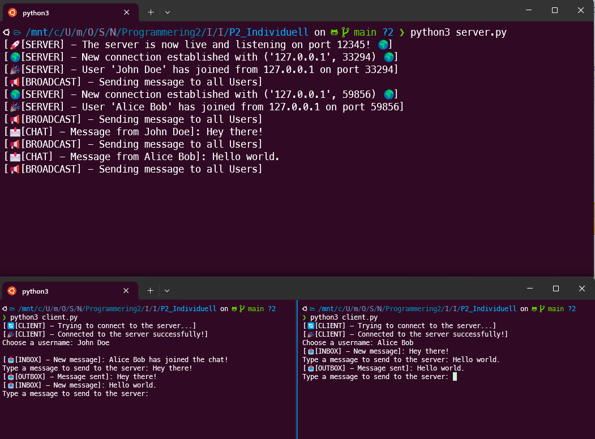

# 🌐 TCP Chat-Hub

Welcome to **TCP Chat-Hub**! This project creates 1 server and can be connected to by multiple clients and be used for real time chatting using Python's socket functionality.

## 📜 Table of Contents

- [Preview](#-preview)
- [Features](#-features)
- [Usage](#-usage)

## 📷 Preview

How a session looks with 2 clients connected to the server.

## ✨ Features

- **handle_clients**: Assigns nicknames to clients, handles incoming messages, and removes disconnected clients.
- **broadcast_message**: Sends messages to all connected clients, excluding the sender.
- **start_server**: Initializes the server, accepts new clients, and starts a separate thread for each client.
- **receive_messages (client.py)**: Continuously listens for messages from the server and displays them.
- **send_messages (client.py)**: Takes user input and sends it to the server.

## 🚀 Usage

1. **Start the Server**:
   - Run `server.py`
2. **Connect Clients**:
   Each client via `client.py` will prompt for a username upon starting, then connect to the server. Clients can send messages, which will be broadcast to all connected clients.
---

> **Enjoy chatting!** 😊
